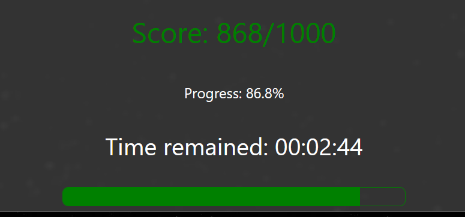

## Introduction
A Purple Team Exercise is a comprehensive information security assessment that fosters collaboration among participants to engage in attacking, detecting, and responding activities. These exercises encourage a "hands-on keyboard" approach, where participants actively work together, engaging in open discussions about various attack techniques and expected defense measures. The primary purpose of Purple Team Exercises is to assess, measure, and enhance the effectiveness of people, processes, and technologies in real-time. These exercises emulate real-world Tactics, Techniques, and Procedures (TTPs), enabling organizations to identify and address vulnerabilities in their security posture. The ultimate objective is to bolster resilience against existing threats by proactively detecting and responding to attacks before they can cause significant impact.

The exercise will last one hour and will involve a total score. For every asset or user compromised by the red team, points will be deducted. However, for every asset restored or attack halted, the score will increase. At the end of the hour, the blue or red team will be declared the "winner" based on the final cumulative score.

The folllowing vulnerabilities will be random generated during the challenge to provide the red team with new opportunities and make the game dynamic:

- Default password, not changed by users
- Password in user description
- Bad ACLs
- Kerberoastable users
- REP-roastable users
- DCSync privileges
- Service abuse
- User credentials in LSASS
- Constrained Delegations for Users and Computers
- Unconstrained Delegations for Computers
- Windows Defender exception

## Dependencies
Put in the same directory:

- AD_network.json (specifies the win condition, contains details about assets and user roles, and the points assigned to them)
- config.json (contains settings realted to the server and lab environment)
- [subinacl.exe](https://social.technet.microsoft.com/wiki/contents/articles/51625.subinacl-a-complete-solution-to-configure-security-permission.aspx)

## Prerequisites
Before adding assets to the scenario, please ensure that the following prerequisites are met:

- Machine discovery in domain and guest is ON
- Machines have only a single network interface
- PowerShell is opened in administrator mode on machines
- The following commands have been executed on the machines:

```
winrm quickconfig -q
winrm set winrm/config/client @{TrustedHosts="*"}
```

## Start Up
All scripts must be executed from an external asset that is not joined to the domain.
In the src directory execute the following commands:
1) Run the initializator
   ```
   .\scripts\initializator.ps1
   ```
3) Run the server
   ```
   python server.py
   ```
5) Run start.py, referring to the password specified in the config.json file
   ```
   python start.py
   ```

## Warnings
Please note the following warnings before adding assets to the scenario:

- Ensure that new hostnames are different from old ones
- Use only the built-in "Administrator" local user to allow domain joining (especially for client OS versions). Ensure it is activated on clients and log on with it almost the first time.


## Suggestions
- Install VM with Windows Server Core (a 'GUI-less' version of Windows) to save disk space.
- Clone VMs and run the following commands to speed up:
```
Sysprep /generalize
```
Sysprep generates a new SID for asset allowing successful joining.

## Acknowledgements
Some parts of the code used in this script were adapted from the repository [WazeHell/vulnerable-AD](https://github.com/WazeHell/vulnerable-AD).

# Authors
Gabriele Motta : gabriele.motta.job@gmail.com  
Silvia Frasson :  
Ruggero Tomaselli :  
Gianmarco Lodari :  
Lorenzo Masciullo :

# License
The MIT License (MIT)  
Copyright (c) 2023  
Gabriele Motta, Silvia Frasson, Ruggero Tomaselli, Gianmarco Lodari, Lorenzo Masciullo  
Permission is hereby granted, free of charge, to any person obtaining a copy  
of this software and associated documentation files (the "Software"), to deal  
in the Software without restriction, including without limitation the rights  
to use, copy, modify, merge, publish, distribute, sublicense, and/or sell  
copies of the Software, and to permit persons to whom the Software is  
furnished to do so, subject to the following conditions:  
The above copyright notice and this permission notice shall be included in all  
copies or substantial portions of the Software.  
THE SOFTWARE IS PROVIDED "AS IS", WITHOUT WARRANTY OF ANY KIND, EXPRESS OR  
IMPLIED, INCLUDING BUT NOT LIMITED TO THE WARRANTIES OF MERCHANTABILITY,  
FITNESS FOR A PARTICULAR PURPOSE AND NONINFRINGEMENT. IN NO EVENT SHALL THE  
AUTHORS OR COPYRIGHT HOLDERS BE LIABLE FOR ANY CLAIM, DAMAGES OR OTHER  
LIABILITY, WHETHER IN AN ACTION OF CONTRACT, TORT OR OTHERWISE, ARISING FROM,  
OUT OF OR IN CONNECTION WITH THE SOFTWARE OR THE USE OR OTHER DEALINGS IN THE  
SOFTWARE.  

## Project status
Development
